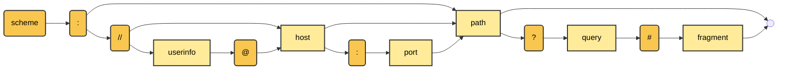

`DRAFT VERSION – v2 04.03.2024`

# QR-Code on paper PDA1

## 1 Goal & use case

While the PDA1 will be also issued as verifiable credential (VC) in the
future, the regular, paper and/or PDF-based document will still be in
place. To do not lose all the benefits which come along with the VC
(e.g., revocation, digital proof, paper-less carrying on), both worlds
shall be combined to also bring these benefits (partly) to people which
are not using the EUDI-Wallet (yet).

From a business perspective, there are two sub use cases which shall be
addressed based on the regular PDA1 document:

1.  Users who do not have an EUDI-Wallet at the time the PDA1 (as
    regular document) is issued should be given the opportunity to
    obtain the PDA1 as verifiable credential at a later date just having
    the regular PDA1 document.
2.  Verifiers who are already able to check the PDA1 as a verifiable
    credential should also benefit even if the user does not have an
    EUDI-Wallet and only presents the document as a paper / PDF.

## 2 Requirements

For the two described sub use case, the following requirements should be
addressed:

**General requirements:**

- If possible, combine both sub use cases in just one QR-code on the PDA1
document, so that it's as easy as possible to the users to handle these
QR-code (not using the wrong QR-Code).

**Holder / user specific requirements:**

- QR-Code should be usable (scannable) from the EUDI-Wallet as well as
with each regular QR-Code scanner.

**Verifier specific requirements:**

- QR-Code should provide data in such a way that the verifier can use &
validate them even in an offline scenario.
- There is no need that the QR-code contains the whole PDA1 document
ratherthan defined data (seedata model in section 3 Data model (business
perspective)).

## 3 Data model (business perspective)

### 3.1 Combined Case for verifier & holder

In order to allow the **verifier** for offline verification, the QR-Code
needs to contain the following information:

-   Issuing Member state
-   Document Type (PDA1)
-   Authentic Source
-   Document Identifier (unique number)
-   Status / revocation information (link to a standardized revocation
    register incl. ID for offline use)
-   Electronic signature

To further, also provide the holder with access to the VC of the PDA1
document, the QR-Code must also **contain a link** to, for instance, the
issuer's backend, so that the holder can request the issuer to issue the
PDA1 as VC. The process for holder identification & authentication
against the issuer as well as the actual issuing is not part of this
document.

### 3.2 Minimal-case -- holder only scenario

As an alternative case to the above described scenario (considered as
standard-scenario), it shall also be possible to generate a QR-Code
which just acts as pick-up code for a holder to receive the VC but can't
be used by a verifier to verify the paper-based PDA1 document.

For this case, the following information is required within the QR-Code:

-   Document Identifier (unique number) acting a collection/pick-up ID
-   Link to the issuer's backend to reach out to for VC issuance

## 4 Approach towards the technical solution

### 4.1 Approach towards handling the requirements

To meet the above specified requirements incl. merging both sub use
cases in just one QR-Code, the following needs to be taken into
considerations:

-   QR-Code must be defined as internet facing link (http/https-based)
    so that every QR-Code scanner as well as every EUDI-Wallet used by
    the holder is able to simply decode the QR-Code and follow the
    provided link. Further logic to unpack or interpret the QR-Code's
    content must not be required. Otherwise, this would risk the general
    adaption and interoperability on an European level.
-   The QR-Code must contain all the specified data (see 3 Data model
    (business perspective)) directly, so that the verifier can also
    access and verify the PDA1 document offline.

### Technical data model

| **Field**                              | **Technical field name** | **Example Data**                             | **Holder & Verifier Scenario** | **Holder-only scenario** |
|----------------------------------------|--------------------------|----------------------------------------------|-------------------------------|--------------------------|
| Link to issuer                         | n/a (it's the link itself, no separate attribute) | https://deutsche-rentenversicherung.de | X                             | X                        |
| Issuing Member state                   | ms                       | DE                                           | X                             |                          |
| Document Type (PDA1)                   | doc_type                 | PDA1                                         | X                             |                          |
| Authentic Source                       | authentic_source         | DRV010                                       | X                             |                          |
| Document Identifier (unique number)    | doc_id                   | VTZ126725                                    | X                             |                          |
| Collection ID                          | collection_ID            | AZ98213                                      | X                             | X                        |
| Status/revocation information (link to a standardized revocation register) | revocation_list | statuslist-3      | X                             |                          |
| Status/revocation information (ID for offline use) | statuslist_index | 94578                                    | X                             |                          |
| Electronic signature (e.g., issuer ID, issuer DID)     | proof_method | 123456789abcdefghij                      | X                             |                          |
| Electronic signature (URL-safe Base64 encoded signature, such as RSA2048 signature. Spaces added for readability.) | proof_value | nJGMzZrTW9UZnZ YYzd0dlhzMjZ3ak1Z ZVg5QW1EdW5FNU c3WGNzdkNKdWVva GVJNnB5MVdVak1P TldyK2VIaE5GdVdkK 3ZiNEtRRFV1cHAxN kZiaXdoL2gwYXViMn l4RGs3YUJMVVFGW WdHaUlEcHhSckI1e WdCYzV0NTNENk5 VOFNIYmlkZWVpN3 hlc2QyWE96bGkzS3I 0QkdlMHA3YktES25 sTjc2TFVCbjNmNnF 5TVBPSXVCc0d3Q0 9nMUE0VUg1ZWhQ cWF2dEZVYjN5NkNs VERpREZBV2swVFZ wQ1l6dysybG9lWU9 XYTJzTEV0cVpLVG RZeHJ2bTlRZ0tacW pKMTBsSmtLclB6TE p6MkViKzExUW1aM G9ERitraU9mdmxqN 0ZaZ3lLZTdzNWt4a0 xocGlDck43a1B5Y3Z CWWxzT2d5TDlLSE RicVNiNGFOM2Vsc WpnPT0 | X |  |

**Notes on the revocation solution:**

-   A PDA1 document can only be revoked and not suspended, therefore no
    status type or purpose is provided in the QR-Code (the type is
    always revocation).
-   The revocation list or solution is defined separately, as the
    "regular" standard StatusList2021Entry most likely does not meet all
    of the requirements from the business side. Therefore (for now),
    only an index and identifier of that list is provided in the
    QR-code.

**Note on the collection_ID:**

-   This ID is provided by the "potential" issuer of the VC and must be
    unique to him, so that the issuer can map a request to the
    respective PDA1 document. There is no need, that this ID is unique
    within the whole ecosystem.

### 4.3 URL definition

The Uniform Resource Locator (short URL) is defined in various RPC
standards, at which the RPC 3986 sets the foundation.

The structure of the URL follows the following syntax:

From the URL definition, the following parts from the defined syntax are
important to the QR-Code definition:

| **Part**   | **Definition**                                                 |
|------------|----------------------------------------------------------------|
| **Scheme** | define used standards, e.g., `https`                           |
| **Host**   | "location" of the webhost, e.g., `www.example.com`             |
| **Path**   | specific path at the webhost (optional), e.g., `/docs/archive` |
| **Query**  | adding key-value-pairs to the URL, e.g., `name=max`            |

The query could be used to add the additional data, which is required by
the verifier, and partly the holder (requires the doc_id to request the
PDA1 as VC from the issuer) directly to the URL. Thereby, the following
rules need to be followed:

-   The query section starts with "?"
-   The key-value-pairs are separated by "&"
-   The value is linked to the corresponding key by "="
-   Furthermore, following characters are reserved characters which must
    not be used within the key-value-pairs to ensure correct
    interpretation by the webserver: `/ ? # [ ] @ : $ & ' ( ) * + , ; =`

Regarding the length of the URL: with HTML 4 being introduced there
isn't any defined limitation anymore (HTML 3 cut the length of URLs to
1024 characters). However, a URL shouldn't be longer than 2048
characters, otherwise it's likely not all browsers and webserver can
process the URL.

Furthermore, the QR-Code is technical limited to 2.956 byte using lowest
error-correction level ("low"). But even if a QR-Code of this size is
technically possible to generate, it needs to be taken into
consideration that not all cameras on the market are of the same
quality. Older models might be not able to scan big QR-Codes with very
small bit-sizes. Therefore, the length of the URL which is put into the
QR-Code should cut to a shorter version, e.g., not exceeding 1.000
characters.

**Example URL holder & verifier scenario:**

https://deutsche-rentenversicherung.de?ms=DE&doc_type=PDA1&authentic_source=DRV010&doc_id=VTZ126725&collection_ID=AZ98213&revocation_list=statuslist-3&statuslist_index=94578&proof_method=123456789abcdefghij&proof_value=RnJGMzZrTW9UZnZYYzd0dlhzMjZ3ak1ZZVg5QW1EdW5FNUc3WGNzdkNKdWVvaGVJNnB5MVdVak1PTldyK2VIaE5GdVdkK3ZiNEtRRFV1cHAxNkZiaXdoL2gwYXViMl4RGs3YUJMVVFGWWdHaUlEcHhSckI1eWdCYzV0NTNENk5VOFNIYmlkZWVpN3hlc2QyWE96bGkzS3I0QkdlMHA3YktES25sTjc2TFVCbjNmNnF5TVBPSXVCc0d3Q09nMUE0VUg1ZWhQcWF2dEZVYjN5NkNsVERpREZBV2swVFZwQ1l6dysybG9lWU9XYTJzTEV0cVpLVGRZeHJ2bTlRZ0tacWpKMTBsSmtLclB6TEp6MkViKzExUW1aMG9ERitraU9mdmxqN0ZaZ3lLZTdzNWt4a0xocGlDck43a1B5Y3ZCWWxzT2d5TDlLSERicVNiNGFOM2VscWpnPT0

Generated as QR-Code:

*Note: to make the QR-Code easier accessable also to older devices, a shorter
signature (e.g., using RSA1024) should be taken into consideration, but keeping
security requirements in mind.*

**Example URL holder only scenario:**

https://deutsche-rentenversicherung.de?collection_ID=AZ98213

Generated as QR-Code:

